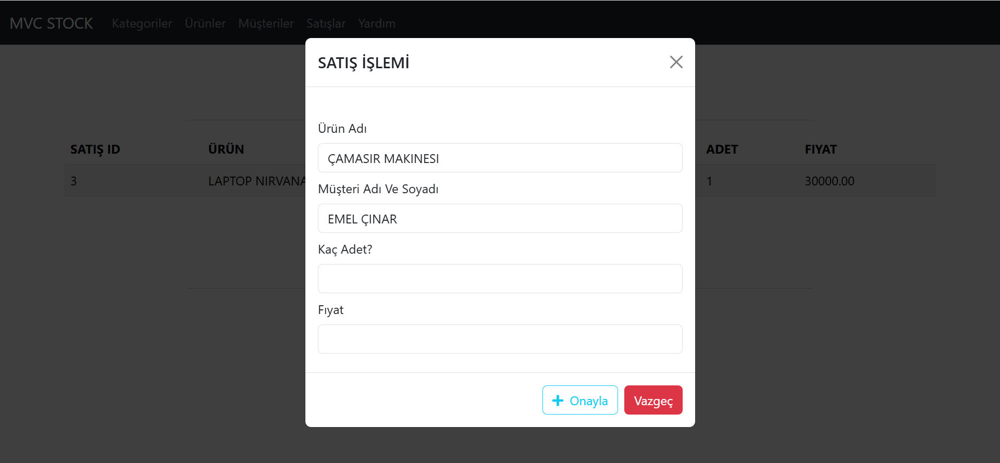

<html>
<head>
    <link rel="stylesheet" href="https://cdnjs.cloudflare.com/ajax/libs/font-awesome/5.15.4/css/all.min.css">
</head>
<body>

# 50 Ders MVC STOK PROJESİ [🚀](https://img.shields.io/badge/Status-Active-brightgreen?style=flat-square)

### Bu Proje Stok ve Müşteri için admin Paneli bir web uygulama geliştirimiş

## Projede :

#### Kullanıllan teknolojiler  🛠:

   <ul style="list-style:circle; margin-left:30px"> 
		<li> Bootstrap 5.3.3 </li>
		<li> Jquery 3.6.0 </li>
		<li> PagedList (pagination için) </li>
		<li> Entity Framework</li>
		<li> DataTables</li>
   </ul>

#### Veri tabanı 🗄️: 

<ul style="list-style:circle; margin-left:30px">
	<li>MSSQL</li>
</ul>

#### Kullanıllan Yapıları 	📚 :

<ul style="list-style:circle; margin-left:30px">
	<li> Entity Framework Database First Yaklaşımı </li>
	<li> Modal </li>
	<li> Firtreleme </li>
</ul>

## Kategoriler Sayfası

## Kategori Ekleme Sayfası

## Ürünleri Sayfası

## Ürün Ekleme Sayfası

## Müşteriler Sayfası

## Müşteri Oluşturma Sayfası

## Satışlar Sayfası

## Satış Oluşturma Modalı

## Yardım Modalı

 Her hangi bir sayfada yardım linki basınca bu modal gözükmektedir

 #### Diagram 

 

 Tabloları arasında ilişki gösterilmektedir.
</body>

<html>

